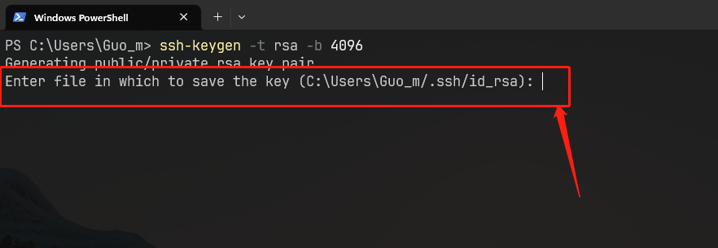
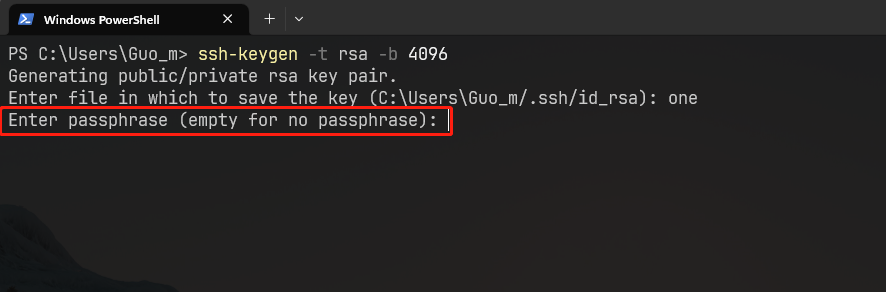
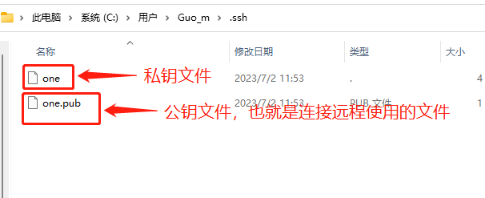
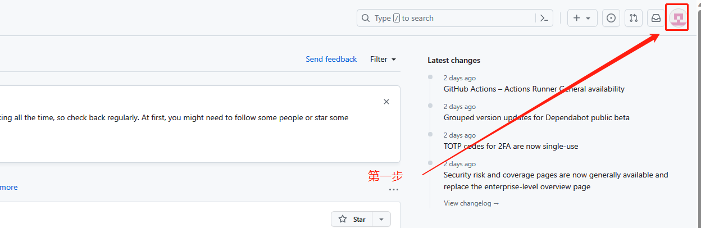
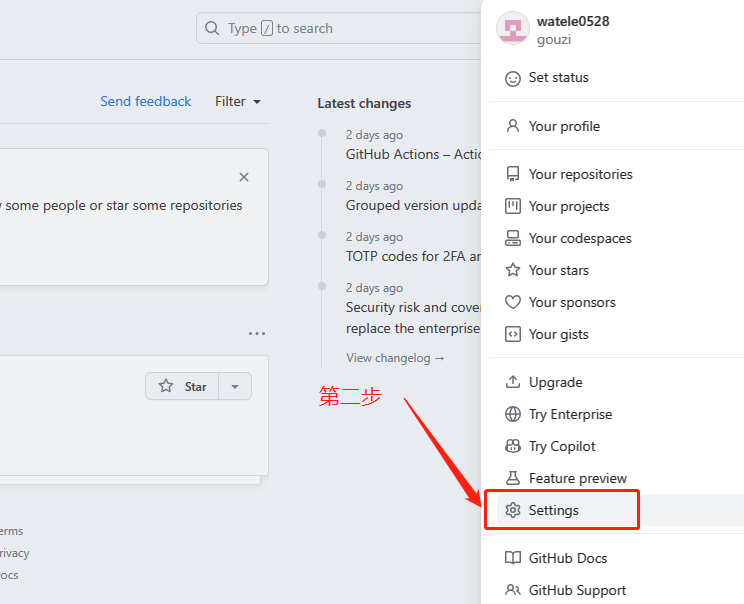
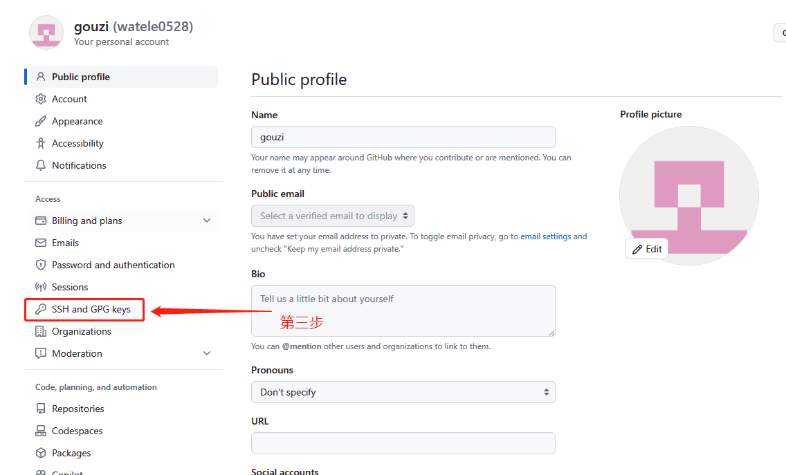
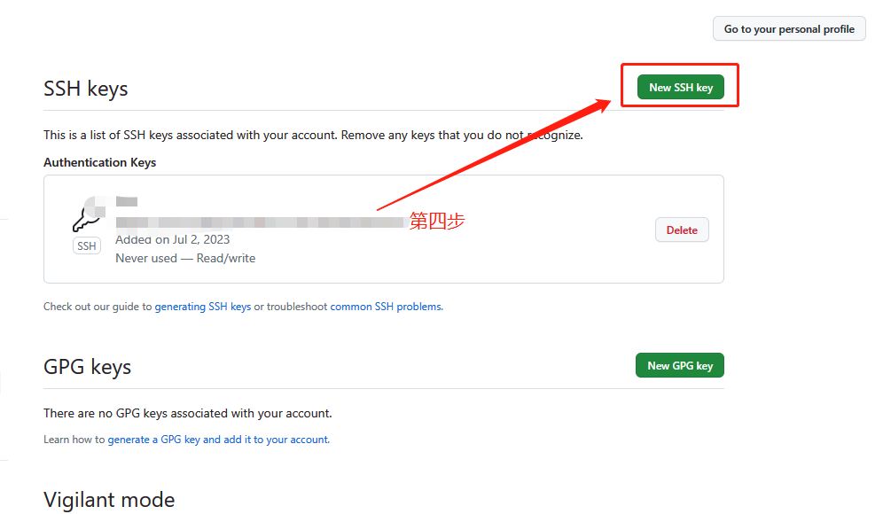

# 远程仓库

`git` 连接远程仓库

## 创建私钥

### step.1 生成秘钥

::: tip 管理秘钥

为了统一管理秘钥，在`用户`目录创建一个 .ssh 目录，进入 .ssh 目录进行创建秘钥。

:::

创建一个 rsa 协议 的 大小为 4096 的秘钥文件

```sh
ssh-keygen -t rsa -b 4096
```


**输入协议名称**



**输入密码（可为空）：**




### step.2 查看秘钥

生成密钥结束后，在当前目录（也就是生成秘钥的目录）会生成两个文件




### step.3 设置秘钥

在 `.ssh` 文件夹中新建一个 `config` 文件

意思是：当我们访问 github 的时候，指定 SSH 使用特定秘钥

```
# github
Host github.com								# github 服务器地址
HostName github.com							# github 服务器名称
PreferredAuthentications publickey
IdentityFile ~/.ssh/one						# 指定 github 的私钥位置
```


## github

- 右上角个人中心 → Seetings → SSH and GPG keys → SSH keys
- 将 `.dep` 公钥文件的内容粘贴到这里












### 关联本地仓库

**添加一个远程仓库**

- `sortname` : 基本上都使用 `origin`， 远程仓库别名
- `url` : 仓库地址

```shell
git remote add <sortname> <url>

例：git remote add origin git@github.com:watele0528/watele0528.github.io.git
```


### 推送

**第一种情况。本地与远程主分支名称相同**

```sh
git push -u orgin main
```


**第二种情况。本地与远程分支名称不同**

- 如果本地仓库主分支为 `master`， 则推送时，应该这么写：

    ``` sh
    git push -u origin master:main
    ```

- 或者，将本地主分支改为 main

    ``` sh
    git branch -M master main
    ```

    - 推送

        ``` sh
        git push -u origin main
        ```


### 拉取

``` sh
git pull
```


### 查看远程分支关联

```shell
git remote -v
```

