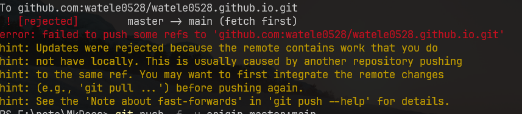

# 其他问题

## 推送时，提示 rejected



**解决方案：**

我选择暴力型

[ master -> master (fetch first)问题的解决方案](https://blog.csdn.net/weixin_44118318/article/details/85030461)


## 22端口屏蔽问题

> [!caution] 提示
>
> ```
> ssh: connect to host github.com port 22: Connection timed out
> fatal: Could not read from remote repository.
> ```

在 `~/.ssh/config` 中配置一下

```
Host github.com
Hostname github.com
Port 443
```


