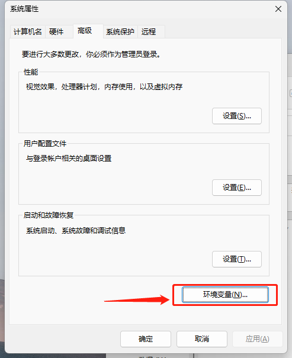
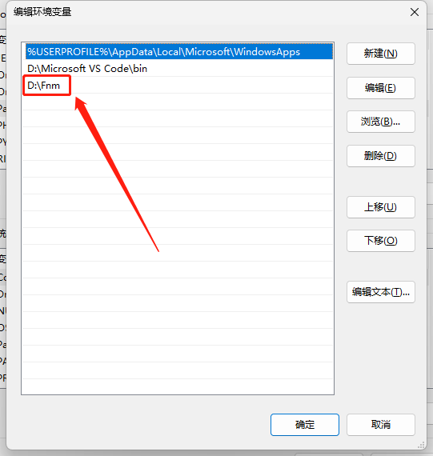
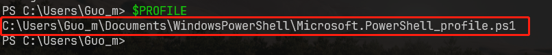
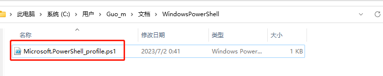
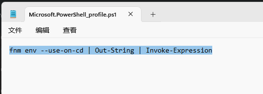
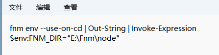

# Fnm

| 命令                 | 说明                          |
| -------------------- | ----------------------------- |
| `fnm --version`      | 查看版本                      |
| `fnm ls-remote`      | 查看可安装的远程版本          |
| `fnm install 版本`   | 安装                          |
| `fnm install --lts`  | 安装最新的`LTS`版本           |
| `fnm uninstall 版本` | 卸载                          |
| `fnm current`        | 显示当前使用的版本            |
| `fnm ls`             | 列出已安装的版本              |
| `fnm use 版本`       | 切换当前`shell`中的`node`版本 |
| `fnm default 版本`   | 设置默认版本，全局            |


- Windows下载地址：[Schniz/fnm (github.com)](https://github.com/Schniz/fnm/releases)
- 官方 Github ： [Schniz/fnm：🚀快速简单的 Node.js版本管理器(github.com)](https://github.com/Schniz/fnm#shell-setup)
- 参考：
    - [Windows 上使用 fnm 安裝 Node.js - Oldest Dream](https://oldestdream.com/2022/04/windows-install-nodejs-with-fnm/#:~:text=%E5%AE%89%E8%A3%9D)
    - [windows 安装fnm node版本管理工具](https://my.oschina.net/gfcm/blog/5712706)
    - [安装 Fast Node Manager (fnm) 以管理 Nodejs 版本 (molingran.com)](https://www.molingran.com/p/use-fnm/)


## 安装

### 1. Windows

- 将下载的 `fnm.zip` 中的 `fnm.exe` 解压缩到想要安装的目录

- 设置 `PATH`






### 2. Linux

**自动安装**

``` bash
curl -fsSL https://fnm.vercel.app/install | bash
```

如果上面一直没反应，则通过下面的命令进行手动安装。


**手动安装**

手动安装的最新下载地址：[Releases](https://github.com/Schniz/fnm/releases)

``` bash
# 手动安装
# 先下载
wget https://github.com/Schniz/fnm/releases/download/v1.34.0/fnm-linux.zip

# 解压
unzip fnm-linux.zip


# bash配置（linux）
# 添加系统变量
vi ~/.bashrc

# 输入 i 插入
# 通过 ↓ 箭头到最后
# 插入
export PATH="/fnm:$PATH"		# 这里的 /fnm 是存放解压 fnm 的目录
eval "$(fnm env --use-on-cd)"

# 按 esc
# 按 :wq 保存退出
# 重新进入 bash
# 或者 source ~/.bashrc 也可以

```

::: danger 提示

上面两个只能执行一个

如果报错：`Permission denied`

则需要修改一下文件权限为 777 

如果还有问题，试试重启看能不能解决

具体修改方法参考：[权限修改](https://blog.csdn.net/zh_1721342390/article/details/104753997)

:::


### 3. Mac

**自动安装**

``` bash
curl -fsSL https://fnm.vercel.app/install | bash -s -- --install-dir "./.fnm" --skip-shell
```

如果上面一直没反应，挂代理，强制模式。


## 配置（使用之前）

### 1. Windows 修改 PowerShell profile

在安装 `node` 版本后，输入 `node -v` 是不生效的，因为没有配置 `powershell` 文件

- 在 `powershell` 中输入 ` $PROFILE`

    > [!caution] 注意
    >
    > 注意：`PowerShell 7`和内置的 `PowerShell` 路径是不一样的，具体请输入 `$PROFILE` 查看具体路径



- 在该路径应该是找不到这个文件，那么直接新增 `Microsoft.PowerShell_profile.ps1` 文件即可



- 在此文件中加入以下字段

```
fnm env --use-on-cd | Out-String | Invoke-Expression
```



- 重新打开 `powershell` 如果报错： 在此系统上禁止运行脚本...
    - 关闭`powershell`
    - 使用 `管理员身份` 运行
    - 输入 `set-executionpolicy remotesigned` 回车 即可
    - 参考：[PowerShell 报错](https://www.cnblogs.com/lovebing/p/16112837.html)


### 2. Linux

如果为 **自动安装**，则需要修改终端配置

在 bash 的配置文件 `~/.bashrc` 中添加以下内容

详细：[详细](https://www.molingran.com/p/use-fnm/#bash)

``` bash
eval "$(fnm env --use-on-cd)"
```


### 3. Mac

在 zsh 配置文件` ~/.zshrc` 添加以下内容

``` bash
eval "$(fnm env --use-on-cd)"
```


## 修改默认安装 node 位置

可以先用 `fnm env` 查看配置

### 1. windows

打开 `Microsoft.PowerShell_profile.ps1` 添加以下内容

```sh
$env:FNM_DIR="E:\Fnm\node"
```

最后看起来像这个样子




### 2. Mac/Linux

``` bash
export FNM_DIR=目录位置
```


## npm 设置 阿里云源

**全局配置**

这里的全局指的是 某版本的全局，而不是系统的全局

```
npm config set registry http://registry.npmmirror.com
```
