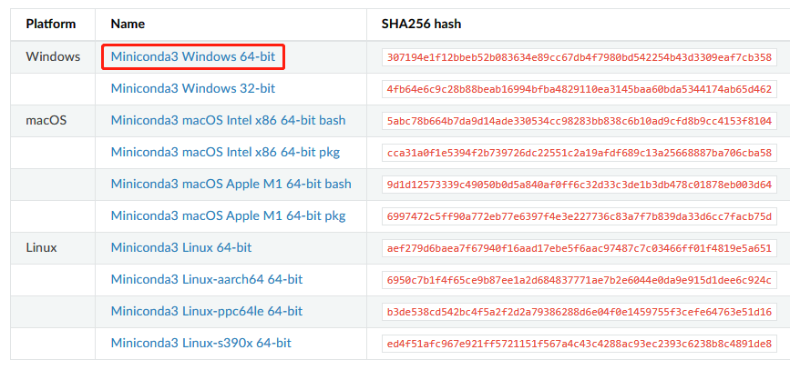
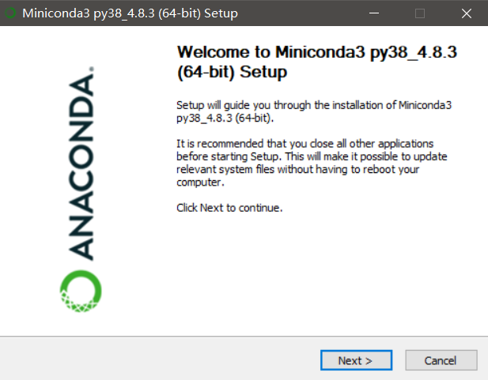
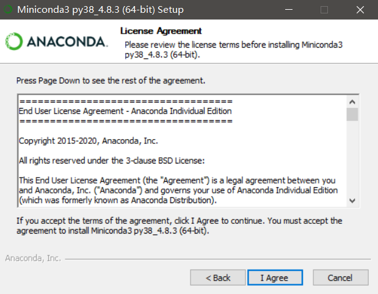
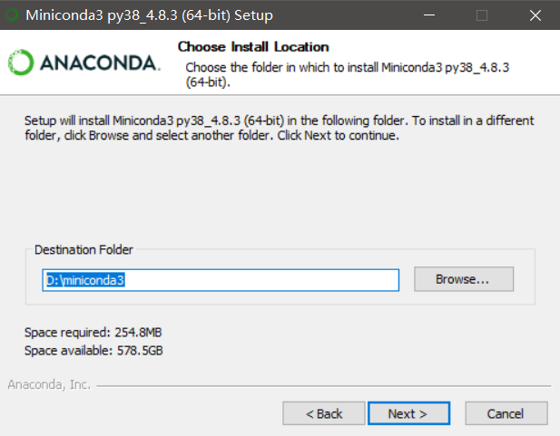
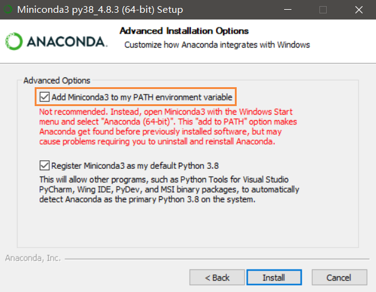
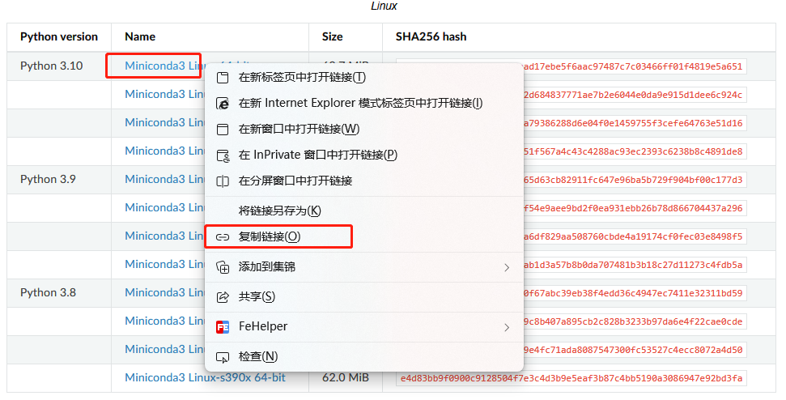
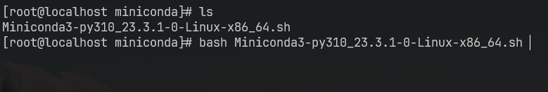
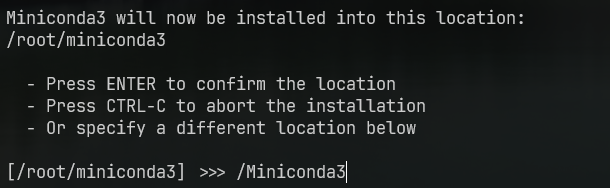
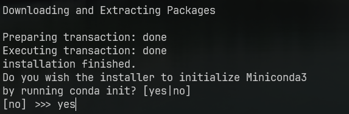
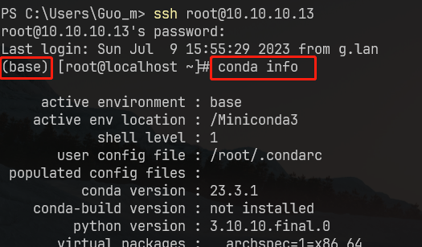

# MiniConda

| 命令                                          | 说明                 |
| --------------------------------------------- | -------------------- |
| `conda create --n <环境名称> python=环境版本` | 创建环境             |
| `conda activate <环境名称>`                   | 激活环境             |
| `conda deactivate`                            | 离开环境             |
| `conda remove -n <环境名称> --all`            | 删除环境             |
| `conda env list`                              | 查看已创建环境       |
| `conda install <包名称>`                      | 安装包               |
| `conda remove <包名称>`                       | 卸载包               |
| `conda update conda`                          | 更新 Conda           |
| `conda info`                                  | 查看当前`conda` 信息 |

官网及下载地址：[Miniconda](https://docs.conda.io/en/latest/miniconda.html)


## Windows

### 下载



### 安装

::: info 提示

安装路径自由选择。安装过程中建议勾选 添加到环境变量， 其他默认即可

:::


- 点击 NEXT




- 点击 I Agree




- 点击 Next


- 安装路径尽量不要选择系统盘，如：`D:\miniconda3` ，点击 NEXT



- 勾选 添加到系统变量，点击 Install




## Linux / Mac

根据系统进行选择，鼠标右键，选择 `复制链接`



### 下载

`wget` 下载 粘贴复制的链接

``` bash
wget https://repo.anaconda.com/miniconda/Miniconda3-py310_23.3.1-0-Linux-x86_64.sh
```


### 安装

``` bash
bash 文件名
```




**1. 一直回车**

**2. 同意**


**3. 选择安装位置**

我一般安装在 `根目录 Miniconda3` 



**4. 初始化 conda**



**5. 重新打开终端即可**




## 更换国内源

### 更换 conda 源

[阿里巴巴开源镜像站](https://developer.aliyun.com/mirror/?serviceType=&tag=&keyword=conda)

- `Linux` 可通过修改用户目录下的 `.condarc` 文件

- `Windows` 无法直接创建名为 `.condarc` 文件，

    可先执行 `conda config --set show_channel_urls yes` 生成该文件再修改

``` yaml
channels:
  - defaults
show_channel_urls: true
default_channels:
  - http://mirrors.aliyun.com/anaconda/pkgs/main
  - http://mirrors.aliyun.com/anaconda/pkgs/r
  - http://mirrors.aliyun.com/anaconda/pkgs/msys2
custom_channels:
  conda-forge: http://mirrors.aliyun.com/anaconda/cloud
  msys2: http://mirrors.aliyun.com/anaconda/cloud
  bioconda: http://mirrors.aliyun.com/anaconda/cloud
  menpo: http://mirrors.aliyun.com/anaconda/cloud
  pytorch: http://mirrors.aliyun.com/anaconda/cloud
  simpleitk: http://mirrors.aliyun.com/anaconda/cloud
```


### 更换 pip 源

::: info 提示

pip 源尽量在环境内更换

:::

[pypi镜像 (aliyun.com)](https://developer.aliyun.com/mirror/pypi?spm=a2c6h.13651102.0.0.2ac31b11FlqliN)

- 全局切换 ( 指的是环境内的pip )

    ``` bash
    pip config set global.index-url https://mirrors.aliyun.com/pypi/simple/
    ```

- 临时使用一次（从 阿里云源 安装 flask）

    ``` bash
    pip install -i https://mirrors.aliyun.com/pypi/simple/ flssk
    ```

    
