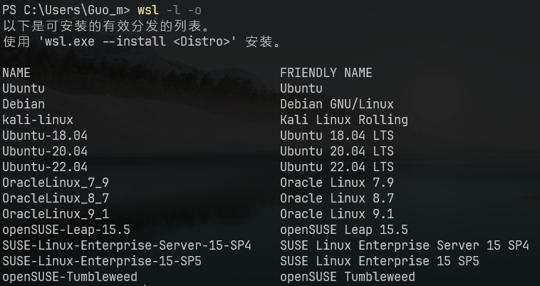
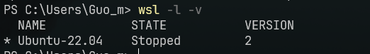
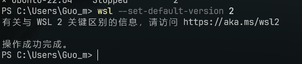
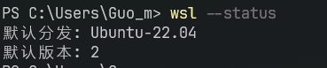
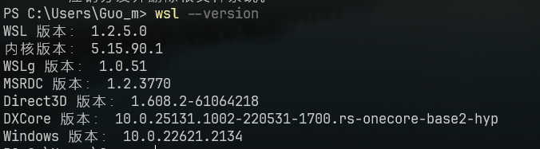

# Wsl

|             命令                                |           说明         |                 其他                                             |
| ------------------------------------------- | ------------------ | ------------------------------------------------------------ |
| `wsl -l -o`                                 | 列出可用子系统     |                                                              |
| `wsl --install -d <name>`                   | 安装某个子系统     | `<name>`发行版名称                                           |
| `wsl --set-default-version <VersionNumber>` | 设置默认的子系统   | `<VersionNumber>`发行版版本                                  |
| `wsl -l -v`                                 | 列出已安装的子系统 |                                                              |
| `wsl --set-default <name>`                  | 设置默认wsl版本    |                                                              |
| `wsl`                                       | 进入默认子系统     | 只对微软官方提供的子系统有效，<br>对自己导入的子系统无效（使用下面的方式） |
| `wsl -d <name>`                             | 进入特定子系统     |                                                              |
| `exit`                                      | 退出当前子系统     |                                                              |
| `wsl -t <name>`                             | 关闭特定子系统     |                                                              |
| `wsl --shutdown`                            | 关闭所有子系统     |                                                              |
| `wsl --version`                             | 检查wsl版本        |                                                              |
| `wsl --unregister <name>`                   | 注销并卸载发行版   | `<name>`发行版名称                                           |

参考

- [安装 WSL | Microsoft Learn](https://learn.microsoft.com/zh-cn/windows/wsl/install)

- [WSL 的基本命令 | Microsoft Learn](https://learn.microsoft.com/zh-cn/windows/wsl/basic-commands#unregister-or-uninstall-a-linux-distribution)


## windows安装wsl

``` powershell
wsl --install
```


## 列出可用的Linux发行版

``` powershell
wsl --list --online
# 简写
wsl -l -o
```





## 列出已安装的Linux发行版

``` powershell
wsl --list --verbose
# 简写
wsl -l -v
```




## 设置默认Linux发行版

``` powershell
wsl --set-default-version <VersionNumber>
# 举例
wsl --set-default-version 2
```




## 更新wsl

``` powershell
wsl --update
```


## 检查wsl状态

``` powershell
wsl --status
```




## 检查wsl版本

``` powershell
wsl --version
```




## 更改发行版的默认用户

``` powershell
<name> config --default-user <Username>
# 示例
Ubuntu-22.04 config --default-user root
```

::: warning 警告

此命令不适用于导入的发行版，因为这些发行版没有可执行启动器。 可以改为使用 `/etc/wsl.conf` 文件来更改导入的发行版的默认用户。 请参阅[高级设置配置](https://learn.microsoft.com/zh-cn/windows/wsl/wsl-config#user-settings)文档中的“自动装载”选项。

:::


## 导出导入发行版

### 导出

``` powershell
wsl --export <name> <FilePath and Name>

# 示例：将 Ubuntu20.04LTS 导出到 D:\wsl\images\
wsl --export Ubuntu20.04LTS D:\wsl\images\my_ubuntu.tar


# 导出之后，把这个卸载掉。不然导入就两个了
wsl --unregister Ubuntu20.04LTS
```


### 导入

``` powershell
wsl --import <name> <安装位置> <导入的发行版>

# 示例
# 还使用之前的名字Ubuntu20.04LTS，不然修改默认用户麻烦
wsl --import Ubuntu20.04LTS D:\wsl\my_ubuntu D:\wsl\images\my_ubuntu.tar --version 2

# 设置默认登录用户为安装时的用户名
Ubuntu20.04LTS config --default-user Username

# 删除 tar 文件（可选）
del xxx
```


## 设置默认wsl版本

``` powershell
wsl --set-default <name>
```


## 关闭

立即终止所有正在运行的发行版和 WSL 2 轻量级实用工具虚拟机。

``` powershell
wsl --shutdown
```


## 注销并卸载linux发行版

``` powershell
wsl --unregister <name>
```

如果将 `<DistributionName>` 替换为目标 Linux 发行版的名称，则将从 WSL 取消注册该发行版，以便可以重新安装或清理它。 **警告：**取消注册后，与该分发版关联的所有数据、设置和软件将永久丢失。 从 Store 重新安装会安装分发版的干净副本。 例如：`wsl --unregister Ubuntu` 将从可用于 WSL 的发行版中删除 Ubuntu。 运行 `wsl --list` 将会显示它不再列出。


## 设置可用内存大小

在 `C:\Users\user` (或在资源管理器地址栏输入`%UserProfile%`) 中新增一个 `.wslconfig`

``` 
[wsl2]
memory=2GB	# 内存
swap=4GB	# 交换区
```

然后`wsl --shutdown` 关闭后，重新打开即可


