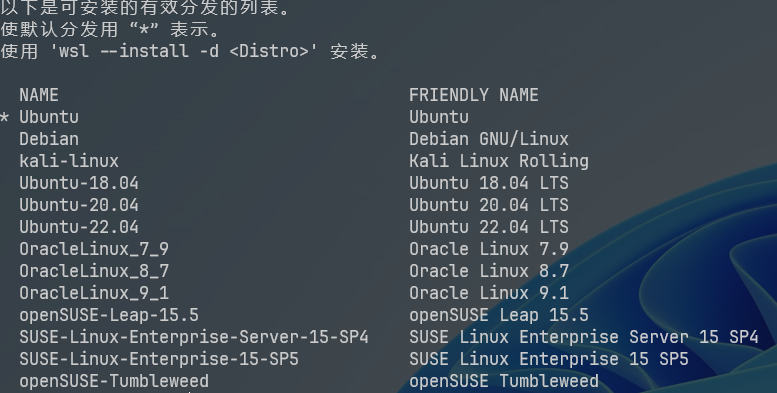
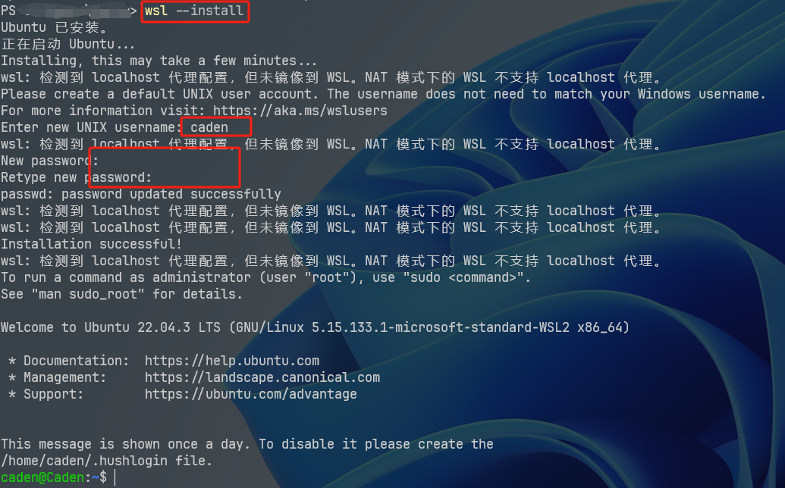
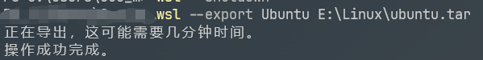
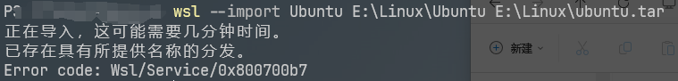
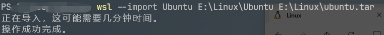
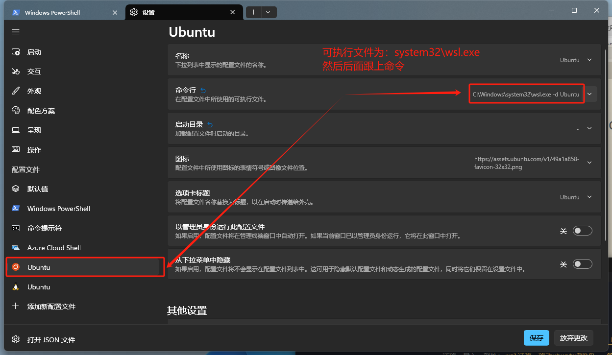

# WSL


文档：[什么是适用于 Linux 的 Windows 子系统 | Microsoft Learn](https://learn.microsoft.com/zh-cn/windows/wsl/about)

迁移、导入、到处：[wsl迁移、移动ubuntu到D盘 - 简书 (jianshu.com)](https://www.jianshu.com/p/203c05c8cba2)


## 命令集合

| 命令                                        | 说明               | 其他                                                         |
| :------------------------------------------ | :----------------- | :----------------------------------------------------------- |
| `wsl -l -o`                                 | 列出可用子系统     |                                                              |
| `wsl --install -d <name>`                   | 安装某个子系统     | `<name>`发行版名称                                           |
| `wsl --set-default-version <VersionNumber>` | 设置默认的子系统   | `<VersionNumber>`发行版版本                                  |
| `wsl -l -v`                                 | 列出已安装的子系统 |                                                              |
| `wsl --set-default <name>`                  | 设置默认wsl版本    |                                                              |
| `wsl`                                       | 进入默认子系统     | 只对微软官方提供的子系统有效， 对自己导入的子系统无效（使用下面的方式） |
| `wsl -d <name>`                             | 进入特定子系统     |                                                              |
| `exit`                                      | 退出当前子系统     |                                                              |
| `wsl -t <name>`                             | 关闭特定子系统     |                                                              |
| `wsl --shutdown`                            | 关闭所有子系统     |                                                              |
| `wsl --version`                             | 检查wsl版本        |                                                              |
| `wsl --unregister <name>`                   | 注销并卸载发行版   | `<name>`发行版名称                                           |


## 常用命令

### 启用并安装默认wsl

``` powershell
wsl --install 
```


### 查看可用发行版列表

``` powershell
wsl --list --online

# 简写
wsl -l -o
```



### 安装一个发行版

``` powershell
wsl --install -d <DistroName>

# 例
wsl -install -d Ubuntu	# 如果直接运行 wsl --install 则会默认安装 Ubuntu
```



### 设置默认 Linux 发行版

``` powershell
wsl --set-default <Distribution Name>

# 例
wsl --set-default Ubuntu
```


### 将WSL版本设置为1或2

**全面设置**

``` powershell
wsl --set-default-version <Version>

# 例
wsl --set-default-version 2
```

**单例设置**

``` powershell
wsl --set-version <distribution name> <versionNumber>

# 例
wsl --set-version Ubuntu 2
```


## 设置用户名密码

文档：[设置 WSL 开发环境 | Microsoft Learn](https://learn.microsoft.com/zh-cn/windows/wsl/setup/environment#set-up-your-linux-username-and-password)

使用 `WSL` 安装 `Linux` 发行版的过程完成后，使用“开始”菜单打开该发行版（默认情况下为 `Ubuntu`）。 系统将要求你为 `Linux` 发行版创建“用户名”和“密码”。

- 此**用户名**和**密码**特定于安装的每个单独的 `Linux` 分发版，与 `Windows` 用户名无关。
- 请注意，输入**密码**时，屏幕上不会显示任何内容。 这称为盲人键入。 你不会看到你正在键入的内容，这是完全正常的。
- 创建**用户名**和**密码**后，该帐户将是分发版的默认用户，并将在启动时自动登录。
- 此帐户将被视为 `Linux` 管理员，能够运行 `sudo` (Super User Do) 管理命令。
- 在 WSL 上运行的每个 Linux 发行版都有其自己的 Linux 用户帐户和密码。 每当添加分发版、重新安装或重置时，都必须配置一个 Linux 用户帐户。
- 若要更改或重置密码，请打开 `Linux` 发行版并输入命令：`passwd`。 系统会要求你输入当前密码，然后要求输入新密码，之后再确认新密码。


::: tip 提示

如果忘记了 `Linux` 分发版的密码：

1. 请打开 `PowerShell`，并使用以下命令进入默认 `WSL` 分发版的根目录：`wsl -u root`

    > 如果需要在非默认分发版中更新忘记的密码，请使用命令：`wsl -d Debian -u root`，并将 `Debian` 替换为目标分发版的名称。

2. 在 `PowerShell` 内的根级别打开 `WSL` 发行版后，可使用此命令更新密码：`passwd <username>`，其中 `<username>` 是发行版中帐户的用户名，而你忘记了它的密码。

3. 系统将提示你输入新的 `UNIX` 密码，然后确认该密码。 在被告知密码已成功更新后，请使用以下命令在 `PowerShell` 内关闭 WSL：`exit`。

:::

> 在安装时，设置账户与密码


## 更改发行版默认用户

``` powershell
<name> config --default-user <Username>
# 示例
Ubuntu config --default-user root
```

::: info 提示

此命令不适用于导入的发行版，因为这些发行版没有可执行启动器。 可以改为使用 `/etc/wsl.conf` 文件来更改导入的发行版的默认用户。 请参阅[高级设置配置](https://learn.microsoft.com/zh-cn/windows/wsl/wsl-config#user-settings)文档中的“自动装载”选项。

:::


## 迁移


`wsl` 默认的安装路径为 `C:\Users\xxx\AppData\Local\Packages` 下，你会找到以 `CanonicalGroupLimited.UbuntuonWindows_` 开头的文件夹（具体名称可能会根据你安装的 Linux 发行版而有所不同），该文件夹包含了 WSL 的安装文件和相关数据。

在随着时间推移，该文件夹占用目录会越来越大，所以我们要将该子系统迁移到其他盘。这里以迁移到`E:\Linux\Ubuntu`为例


### step.1：关闭wsl

``` bash
wsl --shutdown
```


### step.2：导出子系统

**查看要迁移的子系统 Name**

``` powershell
wsl -l -v # 查看要迁移的子系统 Name
```

**执行迁移**

- `<Distribution Name>`：子系统名称
- `<FileName>`：备份导出路径
    - `.tar`：后缀适用于 `wsl1` 和 `wsl2`

``` powershell
wsl --export <Distribution Name> <FileName>

# 例：tar
wsl --export Ubuntu E:\Linux\ubuntu.tar
```




### step.3：卸载原子系统

- `<DistributionName>`：子系统名称

``` powershell
wsl --unregister <DistributionName>
```

::: warning 警告

取消注册子系统后，系统文件并没有删除，需要手动删除

:::


::: warning 警告

如果不卸载原子系统，则在执行第四步导入子系统时，子系统名称应与原子系统区别开来，不然会提示以下：



:::


### step.4：导入子系统

- `<Distribution Name>`：子系统名称，建议与原来的一样
- `<InstallLocation>`：子系统将要安装的路径
- `<FileName>`：备份导入路径

```powershell
wsl --import <Distribution Name> <InstallLocation> <FileName>
```





## 配置文件

文档：[WSL 中的高级设置配置 | Microsoft Learn](https://learn.microsoft.com/zh-cn/windows/wsl/wsl-config#wslconfig)

在 `C:\Users\user` (或在资源管理器地址栏输入`%UserProfile%`) 中新增一个 `.wslconfig`


### 配置内存

```
[wsl2]
memory=2GB	# 内存
swap=4GB	# 交换区
networkingMode=mirrored 	# 镜像网络，启用此功能会将 WSL 更改为全新的网络体系结构，以添加新的网络功能并提高兼容性。
```

然后`wsl --shutdown` 关闭后，重新打开即可


### 配置网络

文档：[使用 WSL 访问网络应用程序 | Microsoft Learn](https://learn.microsoft.com/zh-cn/windows/wsl/networking)


## 其他事项

### git无法连接

[坑：ssh: connect to host github.com port 22: Connection refused](https://zhuanlan.zhihu.com/p/521340971)

```
Host github.com
  Hostname ssh.github.com
  Port 443
```


### 配置 terminal


