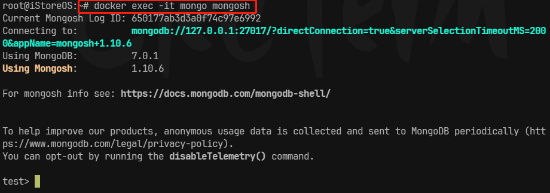
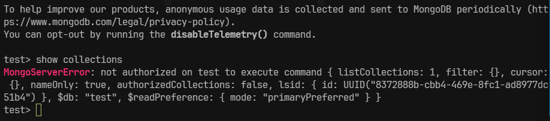
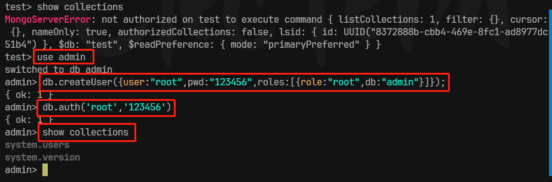

# docker 安装mongodb

- 参考：[MongoDB从入门到实战之Docker快速安装MongoDB](https://zhuanlan.zhihu.com/p/610560696)
- docker hub：[Docker Hub](https://hub.docker.com/_/mongo)


## 拉取

``` bash
# 拉取最新版本

docker pull mongo:latest
```


## 创建并运行

``` bash
docker run -itd --name mongo -p 27017:27017 mongo:latest --auth
```


参数说明：

- `-itd`：i：交互式操作、t：终端、d：后台运行
- `--name`：容器名称
- `-p`：端口映射
- `--auth`：需要密码才能访问容器服务（注意：安全问题，MongoDB默认是不开启权限验证的，不过设置了这里就相当于修改MongoDB的配置auth=ture启用权限访问）


## 进入容器

``` bash
docker exec -it mongo mongosh
```




::: details 提示！



如果使用命令报错 `ongoServerError: not authorized on admin to execute command ` ，则表示当前登陆用户不具备相应权限。

**解决办法：**在admin数据库中通过创建一个用户，赋予用户root权限。

``` bash
# 进入admin数据库
use admin

# 创建一个超级用户
db.createUser(
		{user:"root",
		pwd:"123456",
		roles:[{role:"root",db:"admin"}]
		}
	);

# 授权登录
db.auth('root','123456')
```



:::
