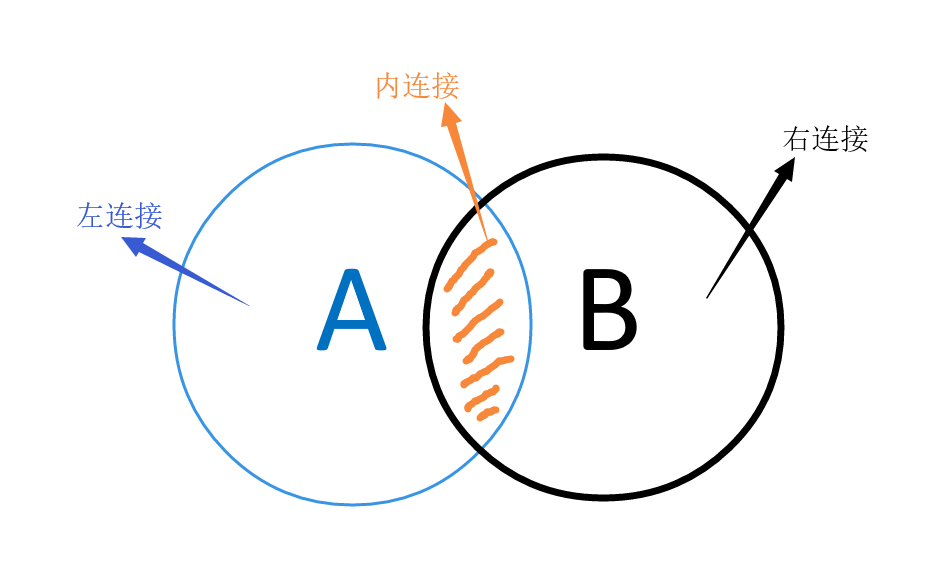
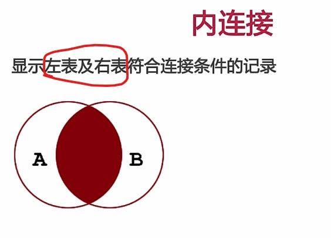
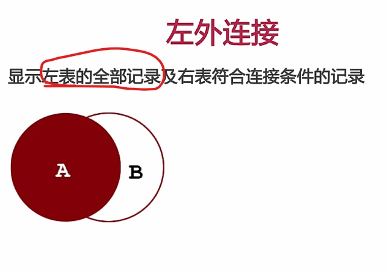
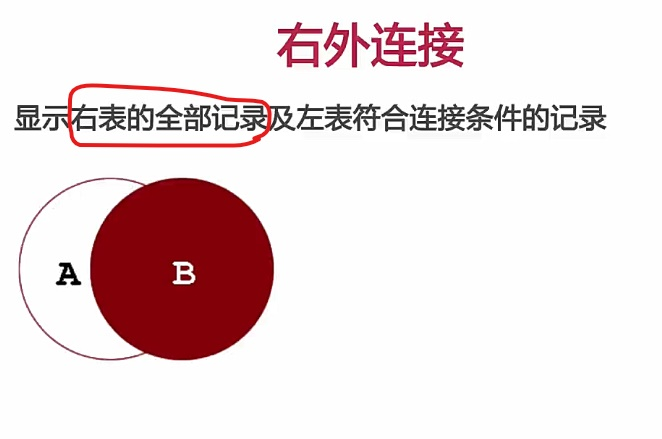

# 多表查询


- 从多表查询数据
- 多表查询时，需要消除无效的[笛卡尔积](https://blog.csdn.net/qq_19800265/article/details/103401272)
- 连接查询
    - 内连接：相当于查 A,B 交集部分数据
    - 外连接：
        - 左外连接：查询左表的所有数据，以及两张表交集部分数据
        - 右外连接：查询右表的所有数据，以及两张表交集部分数据
    - 自连接：当前表与自身的连接插叙，**自连接必须使用别名**
- 子查询

|  分类  | 举例                                                   | 实现                                                         |
| :----: | ------------------------------------------------------ | ------------------------------------------------------------ |
| 一对多 | 一个部门对应多个员工<br>一个员工对应一个部门           | 在多的一方建立外键，指向一的一方的主键                       |
| 多对多 | 一个学生可以选多门课程<br>一门课程也可以被多个学生选择 | 建立第三张`中间表`<br>至少关联两个外键，分别关联两方主键     |
| 一对一 | 单表拆分，基础字段和详情字段                           | 在任意一方加入外键，设置外键为唯一**`unique`**<br>关联另一方主键 |





## 内连接

::: tip 内连接

内连接查询的是两张表交集的部分

:::




### 语法

``` sql
-- 隐式
select 字段列表
from 表1，表2,
where 条件;

-- 显式
select 字段列表
from 表1 
join 表2
on 连接条件...
[ where 查询条件... ];
```


### 示例

``` sql
-- 例如文章表和分类表。 文章表有个字段 classId, 存的是 class 的 ID
-- 现在要查询 文章的标题 和 文章的分类名称

-- 隐式
select a.title, c.name
from article a, class c
where a.classId = c.id;

-- 显式
select a.title, c.name
from article a
join class c
on a.classId = c.id;
```


## 左外连接

::: tip 左外连接

查询 A 表（表1）的所有数据 包含A（表1）和B（表2）交集部分的数据

就算是 右表没有匹配的数据。依然会输出左表所有的数据。

举例：现在要查出 文章 的所有内容，还有对应的 分类 名称，就算是文章 没有对应的分类，依然会输出文章

**输出 `from` 关键字后面跟的表的所有内容**

:::





### 语法

``` sql
select 字段列表
from 表1
left join 表2
on 条件;
```


### 示例

``` sql
-- 例如文章表和分类表。 文章表有个字段 classId, 存的是 class 的 ID
-- 现在要查出 文章 的所有内容，还有对应的 分类 名称，就算是文章 没有对应的分类，依然会输出文章

select a.*, c.name
from article a
left join class c
on a.classId = c.id;
```


## 右外连接

::: tip 右外连接

查询 B 表（表2）的所有数据 包含A（表1）和B（表2）交集部分的数据

输出 `join` 关键字后面跟的表的所有内容

:::




### 语法

``` sql
select 字段列表
from 表1
right join 表2
on 条件;
```


### 示例

``` sql
-- 例如文章表和分类表。 文章表有个字段 classId, 存的是 class 的 ID
-- 现在要查出 分类 的所有内容，和文章的 标题

select a.title, c.*
from article a
right join class c
on a.classId = c.id;
```


## 自连接

::: tip 自连接

自连接查询，可以是内连接，也可以说外连接

:::


### 语法

``` sql
select 字段列表
from 表A 别名 A
join 表A 别名 B
on 条件；
```


### 示例

- 查询员工 及其 所属领导的名字

```sql
# 第一种写法
select a.*,b.name
from emp a,emp b
where a.managerid = b.id;
```

```sql
# 第二种写法
select a.*,b.name
from emp as a
join emp as b
on a.managerid = b.id;
```


- 查询所有员工 emp 及其领导的名字，如果员工没有领导，也要显示出来

``` sql
select a.*,b.name
from emp a
left join emp b
on a.managerid = b.id;
```


