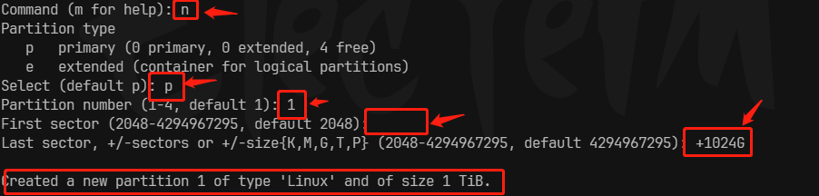
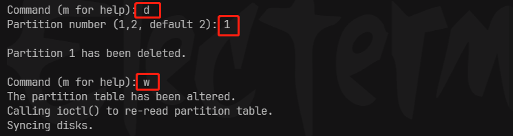
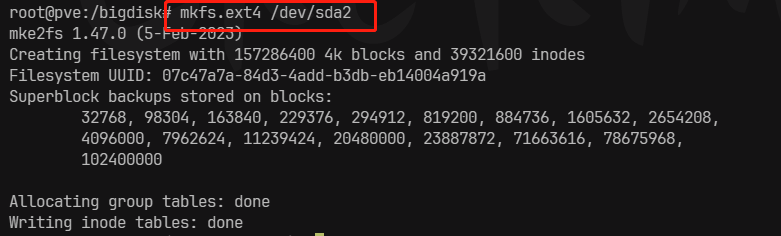

# Linux 新增/挂载磁盘


这里主要是 **挂载** 新磁盘，如果是有数据且格式通用的磁盘，则 **直接挂载** 即可，就不要分区抹数据了，不然数据全没了


::: danger 注意！

`fdisk` 是不能处理`2T`以上的硬盘的，需要用到 `parted`

相关教程：[2T以上硬盘分区，格式化](./4.parted.md)

:::


## 一、格式化整个磁盘

先试用以下命令查看磁盘信息

``` sh
fdisk -l
```

执行格式化

``` sh
mkfs.ext4 /dev/sda
```


## 二、列出设备信息

``` sh
lsblk
```


::: details 设备信息

``` sh
NAME                 MAJ:MIN RM   SIZE RO TYPE MOUNTPOINTS
sda                    8:0    0   2.7T  0 disk 		# -> 为这个磁盘分区、挂载
sdb                    8:16   0 119.2G  0 disk 
├─sdb1                 8:17   0  1007K  0 part 
├─sdb2                 8:18   0     1G  0 part /boot/efi
└─sdb3                 8:19   0 118.2G  0 part 
  ├─pve-swap         253:0    0     8G  0 lvm  [SWAP]
  ├─pve-root         253:1    0  39.6G  0 lvm  /
  ├─pve-data_tmeta   253:2    0     1G  0 lvm  
  │ └─pve-data-tpool 253:4    0  53.9G  0 lvm  
  │   └─pve-data     253:5    0  53.9G  1 lvm  
  └─pve-data_tdata   253:3    0  53.9G  0 lvm  
    └─pve-data-tpool 253:4    0  53.9G  0 lvm  
      └─pve-data     253:5    0  53.9G  1 lvm
```

:::


## 三、磁盘分区

我们要将 `2.7T` 的 `sda` 磁盘重新分区

``` sh
fdisk /dev/sda
```


::: details 输出

``` sh
Welcome to fdisk (util-linux 2.38.1).
Changes will remain in memory only, until you decide to write them.
Be careful before using the write command.


Command (m for help): m
```

:::


输入 `m` 获取帮助，`p` 查看分区表，现在是没有分区的，下面我们创建一个`1024G`的分区。

1. 输入 `n` 新建分区，输入`p` 建立分区
2. 输入建立第几个分区
3. 开始扇区，默认即可
4. 结束扇区，如果分区为`1024G`则输入 `+1024G`，否则不会生效。
5. 最后输入 `w` 保存分区。




::: info 创建多个

上述操作操作完后，可以重新开始创建第二个分区

:::


最后。输入 `lsblk` 检查一下是否成功分区


## 四、删除分区

``` sh
fdisk /dev/sda
```


1. `d` 选择删除操作
2. 输入要删除的分区
3. `w` 保存操作




## 五、格式化分区

``` sh
mkfs.ext4 /dev/sda2
```




## 六、挂载分区

创建一个目录，用来挂载分区，这里挂载到 `/bigdisk` 下

- 临时挂载

    ``` sh
    mount /dev/sda2 /bigdisk
    ```

    

- 永久挂载

    - 查看新分区 `uuid`, 并且记录下来，有用

        ``` sh
        blkid /dev/sda2
        ```

    - 写入 `/etc/fstab`

        ``` bash
        UUID=07c47a7a-84d3-4add-b3db-eb14004a919a /bigdisk ext4 defaults 0 0
        ```

    - 将 `etc/fstab` 的记录挂载。

        ``` sh
        mount -a
        ```

    - 检查

        ``` sh
        df -h
        ```

        

    

## 七、解除挂载

``` sh
umount /dev/sda2
```

如果永久挂载，需要去`etc/fstab`删除那条记录。然后执行 `umount /dev/sda2`
