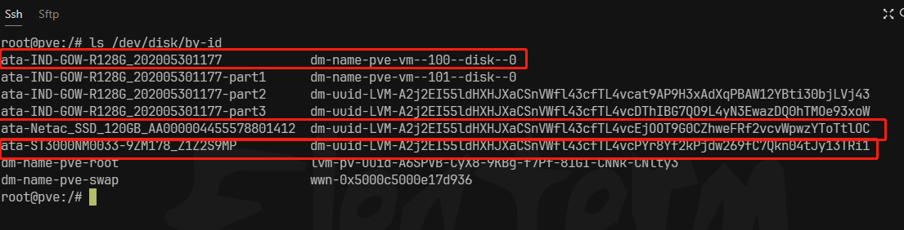
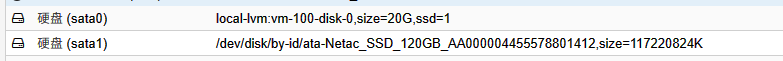

# PVE给单个虚拟机映射整个硬盘

参考：[Proxmox VE直通硬盘（全盘映射方式） - 星哥的博客 (wangxingcs.com)](https://wangxingcs.com/2020/0227/1411/)


::: info 提示

尽量提前在 pve 中将硬盘先格式化成 ext4 格式，如果要分区，也在 pve 中通过命令进行分区。

:::


## 打开PVE管理网页Shell

``` sh
ls /dev/disk/by-id
```





## 硬盘映射

这里需要将100换成虚拟机的真实ID，sata1这里也可以换成未占用的id数（PVE支持satat0-5）

``` sh
qm set 100 -sata1 /dev/disk/by-id/ata-WDC_XXXX_XXXX_XXXX
```

如果返回以下信息,说明已成功映射

``` sh
update VM 100: -sata1 /dev/disk/by-id/ata-WDC_XXXX_XXXX_XXXX
```


## 确认

进入PVE对应虚拟机的硬件页面，查看是否硬盘是否已经在虚拟机里，如图所示说明已成功，这时打开虚拟机就能找到对应硬盘。




::: danger 提示

如果在 pve 中已经对磁盘进行格式化或分区，则在系统中直接挂载即可（linux）

:::