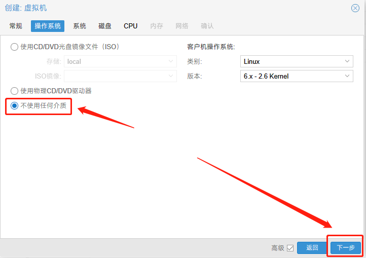

# pve安装openwrt作旁路由

- 参考：

    - [PVE中安装openwrt（IMG镜像文件）_pve安装openwrt_No1_Hp的博客-CSDN博客](https://blog.csdn.net/No1_Hp/article/details/127711813)

    - [OpenWrt系统网络配置和UCI命令详解 - 知乎 (zhihu.com)](https://zhuanlan.zhihu.com/p/638701498)

    - [OpenWrt中，旁路由的设置与使用 - 知乎 (zhihu.com)](https://zhuanlan.zhihu.com/p/112484256)


- 第三方编译 `openwrt` 下载：[Bleach OpenWrt (mpdn.fun)](https://openwrt.mpdn.fun:8443/)


## 创建虚拟机

1. [常规：选好节点，设置好名称](#changgui)
2. [操作系统：选择不使用任何介质](#system)
3. [系统：默认即可](#xitong)
4. [磁盘：删除，不添加任何磁盘](#磁盘)
5. [CPU：根据自己需求选择即可](#cpu)
6. [内存：根据自己需求选择即可](#neicun)
7. [网络：根据自己需求添加](#wangluo)


**常规**<span id='changgui'></span>


**操作系统**<span id='system'></span>



**系统**<span id='xitong'></span>


**磁盘**<span id='cipan'></span>


**CPU**<span id='cpu'></span>


**内存**<span id='neicun'></span>


**网络**<span id='wangluo'></span>


## 制作镜像盘

1. 进入 PVE 的 shell


2. 切换到镜像目录，可以看到我们上传的镜像。

``` sh
cd /var/lib/vz/template/iso
```


3. 执行以下命令，创建镜像盘

``` sh
qm importdisk [虚拟机id] [镜像名称] local-lvm

# 例我们的 虚拟机id 是 103 ，镜像名称是 openwrt.img
qm importdisk 103 openwrt.img local-lvm
```


4. 提示 `success` 即为成功


## 挂载镜像盘

1. 可以在 `local-lvm -> VM 磁盘 -> vm-id-disk-编号` 查看我们的镜像盘


2. 挂载

    1. 在虚拟机的硬件中，会出现一个未使用的磁盘

        

    2. 选择磁盘，点击编辑，勾选ssd仿真，点击添加

        

    3. 在选项中，点击引导顺序， 将刚刚挂载的磁盘的已启用打开，然后通过左边的`三`拖动至 `1`。然后点击 OK。就完成了

        

## 启动

这个镜像在加载完需要按一下回车，才能确认是否启动成功。


## 设置网络

- 正常情况下，在我们的电脑端是无法访问 `openwrt` 的，
- 需要将它的 `ip` 以及 `网关` 设置为我们的局域网
- 相关命令查询：[OpenWrt系统网络配置和UCI命令详解 - 知乎 (zhihu.com)](https://zhuanlan.zhihu.com/p/638701498)


在虚拟机控制台中：

::: info 我家局域网的网段及网关

局域网：10.10.10.1~10.10.10.255

网关：10.10.10.1

:::

- 设置ip为：`10.10.10.100`: 

    - ```sh
        uci set network.lan.ipaddr='10.10.10.100'
        ```

- 设置网关：

    - ``` sh
        uci set network.lan.gateway='10.10.10.1'
        ```

- 查看是否配置成功：

    - ``` sh
        uci show network.lan
        ```

- 重启网络配置：

    - ``` sh
        ubus call network reload
        ```


## 设置旁路由

- 打开：`10.10.10.100`

- 登录：

    - 账号：`root`

    - 密码：`password`


1. [打开 Lan 修改](#xiugai)
2. [DHCP 服务器，忽略此接口](#dhcp)
3. [DNS服务器，设置为主路由地址](#dns)


---


<span id='xiugai'>1</span>


<span id='dhcp'>2</span>


<span id='dns'>3</span>

